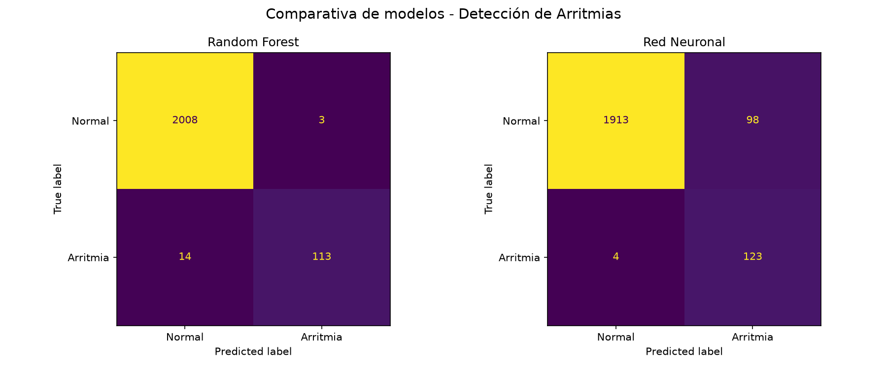
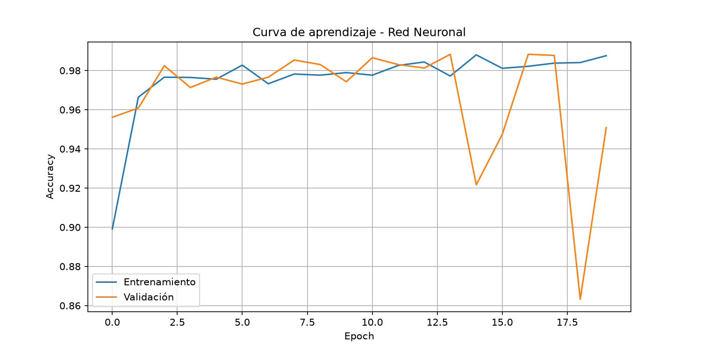

# 🫀 Detector de Arritmias ECG con IA


Sistema de detección automática de arritmias cardíacas a partir de señales ECG reales, utilizando técnicas de procesado de señal biomédica y dos modelos de Machine Learning: Random Forest y Red Neuronal. Incluye una aplicación web interactiva desarrollada con Streamlit.

---

## 📋 Tabla de contenidos

- [Demo](#-demo)
- [Descripción del proyecto](#-descripción-del-proyecto)
- [Dataset](#-dataset)
- [Estructura del proyecto](#-estructura-del-proyecto)
- [Modelos y resultados](#-modelos-y-resultados)
- [Instalación](#-instalación)
- [Uso](#-uso)
- [Limitaciones y mejoras futuras](#-limitaciones-y-mejoras-futuras)
- [Tecnologías](#-tecnologías)

---

## 🎬 Demo

La aplicación permite seleccionar cualquier paciente de la base de datos MIT-BIH, visualizar su señal ECG con anotaciones médicas y analizarla con cualquiera de los dos modelos de IA.



---

## 📖 Descripción del proyecto

El proyecto aborda un problema real de salud: la detección automática de arritmias cardíacas a partir de señales electrocardiográficas (ECG). Las arritmias son alteraciones del ritmo cardíaco que, si no se detectan a tiempo, pueden derivar en complicaciones graves.

El pipeline completo del proyecto incluye:

1. **Carga de señales ECG reales** desde la base de datos MIT-BIH
2. **Procesado de señal** — extracción y segmentación de latidos individuales
3. **Construcción del dataset** — 10.690 latidos de 8 pacientes distintos etiquetados por cardiólogos
4. **Entrenamiento de dos modelos** — Random Forest y Red Neuronal
5. **Evaluación y comparativa** de rendimiento entre ambos modelos
6. **Aplicación web interactiva** para visualizar y analizar señales en tiempo real

---

## 🗃️ Dataset

Se utiliza la **MIT-BIH Arrhythmia Database**, uno de los datasets más utilizados en investigación de procesado de señal biomédica. Contiene grabaciones ECG de 48 pacientes a 360 Hz de frecuencia de muestreo, cada una con anotaciones realizadas por cardiólogos.

Las grabaciones utilizadas en este proyecto son: 100, 101, 104, 105, 106, 108, 109 y 111.

Cada latido se extrae como una ventana de 180 muestras (90 antes y 90 después del pico R), centrada en el punto de máxima amplitud. Las etiquetas utilizadas son:

- `N` → Latido normal → clase 0
- `V` → Contracción ventricular prematura → clase 1
- `A` → Fibrilación auricular → clase 1

El dataset final contiene 10.690 latidos, de los cuales 10.030 son normales y 660 son arritmias.

---

## 📁 Estructura del proyecto

```
ECG-Signals/
│
├── 01_cargar_ecg.py          # Carga y visualización básica de señal ECG
├── 02_extraerdato.py         # Visualización de señal con anotaciones médicas y extracción de datos
├── 03_dataset_completo.py    # Construcción del dataset con múltiples pacientes
├── 04_random_forest.py       # Entrenamiento y evaluación del Random Forest
├── 05_red_neuronal.py        # Entrenamiento y evaluación de la Red Neuronal
├── 06_visualizacion.py       # Gráficas comparativas de resultados
├── app.py                    # Aplicación web con Streamlit
│
├── latidos.npy               # Dataset de latidos procesados
├── etiquetas.npy             # Etiquetas del dataset
├── modelo_random_forest.pkl  # Modelo Random Forest entrenado
├── modelo_red_neuronal.keras # Red Neuronal entrenada
│
└── requirements.txt          # Dependencias del proyecto
```

---

## 📊 Modelos y resultados

Se entrenaron y compararon dos modelos con el mismo dataset y la misma división train/test (80/20).

### Random Forest

Ensemble de 100 árboles de decisión con `class_weight='balanced'` para gestionar el desbalanceo de clases.

```
              precision    recall  f1-score
    Normal       0.99      1.00      1.00
  Arritmia       0.97      0.89      0.93

  accuracy                    0.99
```

### Red Neuronal (Dense)

Red neuronal fully-connected de 4 capas con 33.537 parámetros entrenables.

```
Arquitectura: Input(180) → Dense(128) → Dense(64) → Dense(32) → Dense(1)
Activación oculta: ReLU
Activación salida: Sigmoid
Optimizer: Adam
Epochs: 20
```

```
              precision    recall  f1-score
    Normal       1.00      1.00      1.00
  Arritmia       0.95      0.94      0.95

  accuracy                    0.99
```

### Comparativa

| Métrica | Random Forest | Red Neuronal |
|---|---|---|
| Accuracy | 99% | 99% |
| Recall Arritmia | 0.89 | **0.94** |
| F1 Arritmia | 0.93 | **0.95** |
| Arritmias perdidas | 14 | **4** |

La Red Neuronal supera al Random Forest en recall de arritmias — el indicador más crítico en contexto médico, ya que un falso negativo (arritmia no detectada) es más peligroso que un falso positivo.



---

## ⚙️ Instalación

```bash
# Clona el repositorio
git clone https://github.com/marcos-delicado-teleco/ECG-Signals.git
cd ECG-Signals

# Crea un entorno virtual
python -m venv .venv
.venv\Scripts\activate  # Windows
source .venv/bin/activate  # Mac/Linux

# Instala las dependencias
pip install -r requirements.txt
```

---

## 🚀 Uso

### Construir el dataset y entrenar los modelos

```bash
python 03_dataset_completo.py   # Descarga y procesa los datos (~2 min)
python 04_random_forest.py      # Entrena el Random Forest
python 05_red_neuronal.py       # Entrena la Red Neuronal
```

### Lanzar la aplicación web

```bash
streamlit run app.py
```

---

## ⚠️ Limitaciones y mejoras futuras

**Limitaciones actuales:**

La Red Neuronal fue entrenada con `class_weight={0:1, 1:15}`, lo que la hace muy sensible a las arritmias pero genera más falsos positivos que el Random Forest. En uso real esto se ajustaría según el contexto clínico — en screening masivo se prefiere alta sensibilidad; en diagnóstico definitivo se prioriza la especificidad.

El dataset utiliza solo 8 de los 48 pacientes disponibles en MIT-BIH, lo que limita la capacidad de generalización del modelo a nuevos pacientes.

**Mejoras propuestas:**

- Ampliar el dataset a los 48 pacientes del MIT-BIH
- Implementar una CNN 1D sobre la señal cruda en vez de una red Dense
- Añadir filtrado de señal (paso banda 0.5-40 Hz) como paso de preprocesado
- Clasificación multiclase (Normal / Arritmia auricular / Arritmia ventricular)
- Ajuste del umbral de decisión según el contexto clínico

---

## 🛠️ Tecnologías

- **Python 3.10+**
- **wfdb** — lectura de señales ECG del MIT-BIH
- **NumPy / Pandas** — manipulación de datos
- **Matplotlib** — visualización de señales y resultados
- **Scikit-learn** — Random Forest y métricas de evaluación
- **TensorFlow / Keras** — Red Neuronal
- **Streamlit** — aplicación web interactiva

---

## 👤 Autor

**Marcos-delicado-teleco** — proyecto de portfolio de Machine Learning aplicado a señal biomédica.
